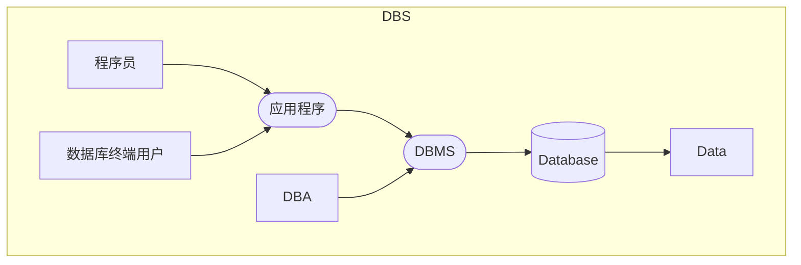
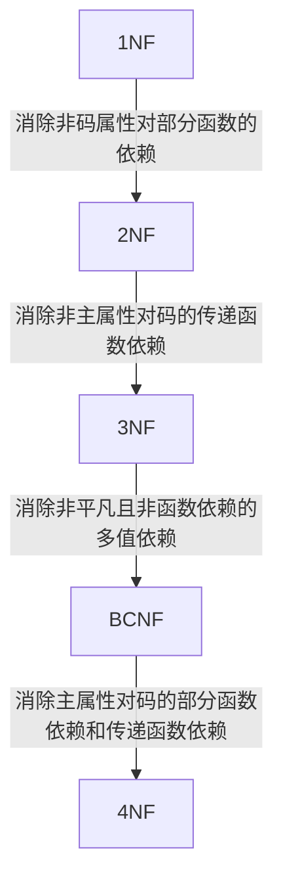

## 概述
### 术语
- DBMS
是数据库管理系统的简称。
- 数据库
是长期储存在计算机内、有组织、可共享的大量数据的集合。

数据库中的数据按照一定的数据模型组织，描述和存储，可以被各种用户共享，具有较小的冗余度，较高的数据独立性，并且易于拓展。
- 数据库系统
由数据库、DBMS、应用程序和数据库管理员组成。

- 数据模型
是用来对现实世界抽象的工具，用于数据建模，描述数据与数据之间的关系。

> 由三部分（具体见下方三要素）组成：
数据结构，数据操作，数据完整性约束。
- 数据库模式
描述了数据库中数据的组织方式和特征。

对于关系数据库而言，数据库模式由一组关系模式构成。
- 数据字典
数据字典是DBMS维护的一系列内部表，用来存放元数据。
### DBMS的主要功能
1. 数据定义。
2. 数据组织，存储和管理功能。
3. 数据操纵
4. 数据事务管理和运行管理
6. 数据库的建立和维护
### 使用数据库进行信息化管理有哪些好处？
1. 数据库整体结构化
2. 数据可以充分共享
3. 数据具有独立性
4. 数据标准化
5. 数据由DBMS统一管理和控制，使得系统能够为数据管理提供更多支持。 
### 数据模型的三个基本要素是
1. 数据结构
描述数据库的对象和对象之间的联系，是对数据的静态描述。关系模型只有关系一种数据结构。
1. 数据操作
数据库中各种对象允许的操作和操作规则，是对系统的动态描述，定义数据操作的方法有两种：关系代数和关系演算。
1. 完整性约束
关系模型的完整性约束包括==实体完整性，参照完整性和用户定义的完整性约束。==
### 数据库系统的三级模式结构
- 外模式
也称为用户模式，是用户或应用程序能够看到和访问的局部数据的逻辑结构和特征的描述，是数据库用户的数据视图。
- 概念模式(模式)
是数据库中全体数据的逻辑结构和特性的描述，是所有用户的公共视图。
- 内模式
是数据在数据库的内部表示，对数据的索引方式，物理结构和存储方式的描述
### 什么是二级映像
三个模式之间的转换

外模式/模式映像

模式/内模式映像
### 物理独立性和逻辑独立性
- 物理独立性
用户的应用程序与数据库的物理存储结构无关，内模式改变后只需要对模式/内模式映像进行修改，而不用修改应用程序。
- 逻辑独立性
用户的应用程序和数据库的逻辑结构无关，当模式改变时只需要改变模式/外模型映像即可。
### DBA的主要职责
- 决定数据库中的信息内容和数据的逻辑结构。
- 决定数据库的存储结构和存取策略。
- 定义数据的安全性要求和完整性约束条件。
- 数据库的日常维护。
## 关系数据库
- 关系
一张二维表，表名就是关系名。
- 属性
二维表中的列
- 元组
二维表中的一行
- 关系模式
对关系的描述
- 候选码
一个属性集的值可唯一标识一个关系的元素，又不含多余的属性。
- 主码
关系模式中候选码中选取的一个作为主码。
- 主属性
包含在任意候选码中的属性。
- 非主属性
不包含在任意候选码中的属性。
- 外键
关系模式R中的属性K是其他关系模式的主键，则称K是R的外键。
### 实体完整性与参照完整性的规则
- 实体完整性
关系中元组在组成主键的属性上不能有空值。
- 参照完整性
要么取空值，要么取参照表中某个元组的主码值。
### 自然连接和等值连接的异同
两个都是常用的连接。自然连接是一种特殊的等值连接，它要求两个关系中进行比较的分量必须是相同的属性组，并且在结果中把重复的属性列去掉。
### 完整性约束的作用
- 保护数据的一致性和准确性
- 提高数据库的安全性和完整性
## SQL
### SQL的基本特点
- 综合统一
- 高度非过程化
只需要支持要做什么，不需要指出怎么做。
- 面向集合的操作方式
- 语言灵活，功能强大
### SQL的基本功能
- 定义模式
- CRUD
- 定义视图
- 定义完整性约束条件
- 授权
- 事务
### SQL定义语言DD(Define)L包括
- 模式，表，视图，域，断言的定义，修改，删除
- 授权的定义和回收
### 什么是存储过程
> 一组为了完成特定功能的SQL语句集，经编译创建并保存在数据库中，用户通过指定存储过程的名字并给出参数(如果需要参数)来执行它。
- 一个业务同时对多个表进行操作，可以考虑使用存储过程。
- 多条件多表联合查询。
### 基本表，视图的区别和联系。
- 基本表 
本身存在的表
- 视图
从一个或几个基本表导出的表是一个==虚表==。
- 联系
所有视图都是直接或间接的由基本表定义的。
- 区别
视图并不存储数据
### 视图的优点
1. 简化用户操作。
2. 可以让用户从多种角度来看同一组数据。
3. 提供了一定程度的逻辑独立性。
4. 提高数据的安全性。
### 嵌入式SQL
> 将sql嵌入到变成语言中
- SQL只能表达常见的查询，但是不能表达所有的查询。
- 一些非数据库操作，如文件操作，网络操作等，不能直接用SQL表达。
### 相关子查询和不相关子查询
子条件查询不依赖父查询，称为不相关子查询。
子条件查询依赖父查询，称为相关子查询。
### 游标
游标是系统为用户开放的缓冲区,用于存放`SQL`语句的执行结果。
游标通常用于遍历查询结果集，允许应用程序逐行处理查询结果。

游标的作用包括：
1. 逐行处理数据：游标允许程序逐行访问查询结果集中的数据，这对于需要逐行处理数据的情况非常有用，比如在编写存储过程或批处理作业时。
2. 定位和导航：游标提供了定位和导航查询结果集的能力，允许程序员在结果集中移动到特定的行或记录。
3. 数据检索：通过游标，可以在结果集中检索数据，以便在应用程序中进行处理、分析或展示。
4. 数据更新：游标还可以用于在结果集中更新、删除或插入数据，允许应用程序对查询结果进行修改。

游标操作通常比批量操作效率低，且可能会引起性能问题。开发中尽量使用批操作来替代游标
## 完整性和安全性
### 什么是数据库的完整性？安全性？
- 完整性
数据库的完整性是指数据的正确性和相容性。
- 安全性
保护数据库防止不合法的使用所造成的数据泄露、更改、破坏等。
### 维护数据库完整性DBMS应该提供哪些支持？
- 违约处理
- 完整性检查机制
- 提供定义完整性约束条件的机制
### 实体完整性的定义和违约处理
- 定义

建表的时候使用`primary key`来定义。
一种是定义为列级约束条件，另外一种是定义为表级约束条件。
- 违约处理
当用户进行操作的时候会检查主码值是否唯一或者为空，如果满足条件则拒绝。
### 参照完整性的定义和违约处理
- 定义
使用`foreign key`来定义外码，用`references`来指明这些外码参照哪些表的主码
- 违约处理
1. 拒绝处理
2. 级联处理
3. 设置为空值
4. 设置为缺省值
### 用户自定义的完整性
- 断言
- 域约束
- 属性约束
- 关系约束
### 触发器的作用，什么时候用触发器，创建触发器的步骤？
- 作用
触发器是一种程序模块，是数据库的一种自动处理机制。主要作用是保证数据库的安全性。
- 什么时候用触发器
> 触发器通过事件来激活，实现业务规则或约束，自动化任务。
  1. dml触发器
  2. ddl触发器
  3. instead of触发器
- 创建触发器的步骤
  1. 定义触发器
  2. 触发条件
  3. 声明部分
  4. 主体部分
### 实现数据库安全性控制的常用方法和技术？
- 用户表示和鉴别
核对用户信息
- 多层存取控制
具有权限才能访问
- 视图
对不同的用户定义视图。
- 审计
建立审计日志。
- 数据加密
对于传输的信息进行加密。
### 自主存取控制和强制存取控制
- 自主存取控制
用户访问的时候检查用户存取权限
- 强制存取控制
数据对象被授予密级 ，用户也被赋予相应的许可证。 
### 强制存取规则
主体许可证大于等于客体的密级时才能读取相应的客体。

主体许可证小于等于客体的密级时才能写相应的客体。
### 审计
把用户的所有操作都记录到系统的审计日志中，用来分析。
## 关系数据库的设计理论
### 为什么范式会出现
在数据库中不合理的设计会导致数据冗余，更新异常，插入异常，删除异常。
范式理论的出现是为了解决不合理的数据依赖，使数据库设计规范化。
### 解释范式
1. 1NF
每一列都是不可分割的数据项。
1. 2NF
在1NF的基础上，非码属性必须完全依赖于候选码。
1. 3NF
在2NF的基础上，属性不能简介依赖主属性(传递依赖)。（消除传递依赖）
1. BCNF
在1NF的基础上，所有的函数依赖，比如x->y,决定因素x中都是候选码。
1. 4NF
关系模式的属性之间不允许有非平凡且非函数依赖的多值依赖。

- 1NF到2NF消除了非码属性对部分函数的依赖。
- 2NF到3NF消除了非主属性对码的传递函数依赖。
- 3NF到4NF消除了主属性对码的部分函数依赖和传递函数依赖。
- BCNF到4NF消除了非平凡且非函数依赖的多值依赖。

## 数据库设计
### 数据库设计的基本步骤
1. 需求分析
数据字典
2. 概念结构设计
E-R图
3. 逻辑结构设计
将E-R图转化为数据模型。形成模式。同时还能建立数据的外模式。
4. 物理结构设计
设计索引，物理存储安排，设立内模式。
5. 数据库实施
6. 数据库运行和维护
### 什么是数据库设计
对于一个给定的应用环境，构造最优的数据库模式，建立数据库及其应用系统，使之能够有效的存储数据，满足各种用户的应用需求。
### 数据字典的内容及其作用
数据字典通常包括数据项，数据结构，数据流，数据存储和处理过程。

数据字典是关于数据库中数据的描述。
### 设计概念系统结构
特点：能够真实的反应现实世界，事物与事物之间的联系。易于理解，易于修改。易于向数据模型转化

设计策略：
- 自顶向下
首先定义全局概念结构框架，然后逐步细化。
- 自底向上
首先定义局部概念结构框架，然后逐步向上细化。
- 逐步扩张
首先定义核心概念结构，然后向外扩充。
- 混合策略
结合起来
### 逻辑设计阶段主要内容和步骤
> 将概念结构设计阶段设计好的基本E-R图转化为关系数据模型。
1. 将概念结构转化为关系模型
2. 对数据模型优化
### E-R模式合并时发生的三种冲突
1. 属性冲突
域范围不相同
1. 命名冲突
2. 结构冲突
同一个对象在不同地方有不同的身份
### 物理设计的内容和步骤
1. 确定数据库的物理结构
2. 对所设计的物理结构进行评价
### 数据库的运行与维护，从以下几个角度考虑
1. 数据库的转储和恢复。
2. 数据库的安全性，完整性控制。
3. 数据库的性能监督，分析和改造。
4. 数据库的再组织和重改造。
### 再组织和重构造
再组织是按照原设计要求重新安排存储位置，回收垃圾，以提高系统性能。

重改造是修改数据库的模式和内模式。
## 事务和并发控制
### 为什么要并发
1. 提高吞吐量和资源的利用率。
2. 减少平均等待事件和平均响应时间。

并发控制能保证事务的ACID性质，主要是保证事务的隔离性和数据库的一致性。
### 事务的定义
事务是用户定义的数据库操作序列，具有原子性，是一个不可分割的执行单元。它确保数据库操作的一致性和完整性，同时也是恢复技术和并发控制的基本构建块。
### 事务的四大特性
- 原子性
事务中的全部操作是不可分割的。原子性保证了事务的一致性。
- 一致性
事务执行的结果必须是使数据库从一个一致性状态变到另一个一致性状态。满足完整性约束。
- 隔离性
事务的执行不受其他的事务的干扰。
- 持久性
对于任意已提交的事务，系统保证该事务对数据库的改变不会丢失，也就是出现故障。
### 事务并发执行可能导致哪几类数据不一致？怎么解决？
事务并发执行可能导致
  1. 丢失修改
     1. 两个事务同时修改数据，会有一个被覆盖掉。
  2. 读“脏”数据
     1. 读未提交，其他事务回滚导致使用的数据不对
  3. 不可重复读
     1. 一个事务内读到了两个不相同的数据

数据库系统解决这些问题的主要方法是采用封锁技术。
  1. 一级封锁协议可以保证不丢失修改
  2. 二级封锁协议可以保证不读“脏”数据
  3. 三级封锁协议可以保证可重复读
### 封锁的定义
数据库系统中的封锁是指数据库并发执行过程中，将某个事务的所有操作单元全部锁定的操作。
### 封锁的类型
- 排它锁（X锁）
- 共享锁（S锁）
### 锁的类型
活锁又称为饥饿，是一个事务在等待资源的过程中，被无限期地拒绝资源。使用fifo来避免活锁

死锁两个或多个事务在执行过程中，因竞争资源而造成的一种阻塞的现象，若无外力作用，它们将无法推进下去。
### 死锁的检测和预防
检测
  1. 超时法
  2. 设置时间
  3. 超过则死锁

预防
  1. 一次封锁法
  2. 顺序封锁法
     1. 事务按顺序执行
### 事务的可串行化
多个事务并发执行，当且仅当结果与某一次顺序串行执行的结果相同。

可串行化调度是并行调度正确的唯一准则。
### 描述两段锁结构
> 第一阶段只加锁，第二段只释放锁。
协议规定
1. 对任何数据读写之前，必须先加锁。
2. 释放了一个锁之后，事务不能再获取其他的锁。

两段锁协议可以保证事务的可串行化，是充分条件。
## 数据库恢复技术
### 故障的种类
1. 事务内部的故障
2. 系统故障
3. 介质故障
4. 计算机病毒
### 恢复策略
1. REDO重做
正向扫描日志文件，对每个REDO事务重新执行日志文件的登记操作
2. UNDO撤销
逆向扫描日志文件，对每个UNDO事务执行回滚操作
3. COMMIT提交
将事务的修改永久保存到数据库中
4. ROLLBACK回滚
将事务的修改从数据库中撤销
### 故障的种类和恢复方法
- 事务故障
表示非预期的不正常程序结束所造成的故障。

反向扫描文件日志，查找该事务的更新操作，并对那些操作进行逆操作，直到事务开始的标志。
- 系统故障
表示非预期的系统崩溃或断电所造成的故障。

正向扫描日志
  1. 未完成的事务，进行UNDO
  2. 提交的事务，进行REDO
- 介质故障
表示非预期的存储介质故障所造成的故障。

装入数据库副本。装入日志文件副本，并执行恢复。
### 什么是记录检查点？包含哪些内容？
检查点是一类新的日志记录，包括建立检查点时刻所有正在执行的事务清单，这些事务的最新一个日志记录地址
### 数据库转储
- 按照系统状态分类
  1. 静态转储
停止数据库服务，将数据库的当前状态保存到磁盘上
  2. 动态转储
运行事务并转储，但要在转储期间记录数据活动的日志。恢复时通过日志和副本共同恢复
- 转储量分类
  1. 海量转储
一次转储所有的数据
  1. 增量转储
只转储更新过的数据
### 为什么要先登记日志文件，后写数据库？
如果先写了数据库修改，在日志中没有记录，这样就没有办法恢复这个修改了。

如果先写了日志，但是没有修改数据库，这样在恢复时只不过多执行一次undo操作，并不会影响数据库的正确性。
### 使用日志的数据库恢复技术
- 推迟更新技术
每个数据到达提交点之前不能更新数据库；
一个事务的所有更新操作对应的日志记录写入存储器之前，该事务无法到达提交点。
- 即时更新技术
所有更新类型的日志安全的存储到存储器之前，事务T不能更新数据库，也无法提交。
### 什么是数据库镜像？有什么作用？
自动的把数据库中所有或者关键数据复制一份保存在磁盘上

用于数据库恢复，提高数据库的可用性。
### 为什么引入意向锁？含义是什么？
引进意向锁是为了提高封锁子系统的效率。

对任意节点加锁时，都必须先对其上层节点加意向锁。引进意向锁之后，系统对某一数据对象加锁时不必逐个检查锁冲突了。
### IS，IX，SIX锁
- IS锁
对一个数据对象加IS锁代表其后裔节点加S锁
- IX锁
对一个数据对象加IX锁代表其后裔节点加X锁
- SIX锁
先加S锁再加IX锁
## 补充
### 数据库的锁机制
1. 排他锁 独占
2. 共享锁 可以和别人共享
3. 意向锁 指示事务将进行的锁定
### 什么是事务？恢复技术能保证事务的那些特性
事务是一个不可分割的工作单元。

恢复技术保证了事务的 原子性和持久性
### 什么是索引？优缺点？
索引是一种数据结构，用于快速查找和访问数据库表中的特定行。
- 优点
加快检索速度，优化排序和分组操作，减少磁盘IO
- 缺点
占用磁盘空间，降低数据插入更新和删除的速度。
### 什么是ER图？ER图向关系模型的转换规则是什么？ER图的设计原则是什么？
ER图是一种用于描述实体之间关系的图形化工具，常用于数据库概念设计阶段。

实体转化成表，属性转化成字段，联系转化成外键，多对多关系转化成连接表。

设计原则：简单性，完整性，准确性，一致性，可扩展性。
### 并发控制的主要技术
锁，时间戳，乐观控制法，多版本并发控制（MVCC）
### delete和drop的区别
- delete
是dml命令，可以和where子句一起使用，删除满足条件的记录，会被记录在日志中，可以回滚，不会改变表的结构或索引所占空间
- drop
是ddl命令，不能和其他命令一起使用，删除表的结构和所有数据，不会被记录在日志中，不能回滚，会释放表占用的空间
### orm映射
对象关系映射，在关系数据库和对象之间建立了一个映射，使得用户可以操纵对象的方式操纵数据库。