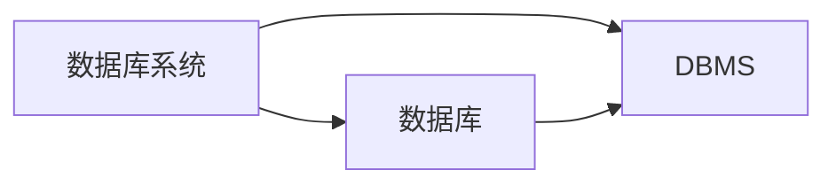

## 概述
### 术语
- DBMS
  
DBMS是数据库管理系统的简称，是一种重要的程序设计系统。它由一个相互关联的数据集合和一组访问这些数据的程序构成。
- 数据库
  
数据库是长期储存在计算机内、有组织、可共享的大量数据的集合。

数据库中的数据按照一定的数据模型组织，描述和存储，可以被各种用户共享，具有较小的冗余度，较高的数据独立性，并且易于拓展。
- 数据库系统

数据库系统由数据库、DBMS、应用程序和数据库管理员组成。

- 数据模型

数据模型是一种形式机制，用于数据建模，描述数据，数据之间的联系，数据的语义，数据上的操作和数据完整性约束的条件。

- 数据库模式

数据库模式是数据库中使用数据模型对数据建模所产生的设计结果。

对于关系数据库而言，数据库模式由一组关系模式构成。
- 数据字典

数据字典是DBMS维护的一系列内部表，用来存放元数据[^1]。

### DBMS的主要功能
1. 数据定义
提供数据定义语言DDL，用于定义数据库中的数据对象和它们的结构。
2. 数据操纵
提供数据操纵语言DML，用于操纵数据，实现对数据库的基本操作(CRUD)。
3. 数据事务管理和运行管理
统一管理数据，控制对数据的并发访问，保证数据的一致性、完整性、有效性。确保故障时数据库中的数据不被破坏，并且能恢复到一致的状态。
4. 数据存储和查询处理
确定数据的物理组织和存取方式，提供数据的持久存储和有效访问。确定查询处理方法，优化查询处理过程。
5. 数据库的建立和维护
提供实用程序完成数据库的批量装载，数据库转储，介质故障恢复，数据库的重组和性能检测。
6. 其他功能
包含DBMS与卡软件通信，异构数据库之间的数据转换和互操作。
### 使用数据库进行信息化管理有哪些好处？
1. 数据库整体结构化
2. 数据可以充分共享
3. 数据具有独立性
4. 数据由DBMS统一管理和控制，使得系统能够为数据管理提供更多支持。
包含事务支持，增强安全性，保证完整性。
5. 数据标准化
### 数据模型的三个基本要素是
1. 数据结构
描述数据库的对象和对象之间的联系，是对数据的静态描述。关系模型只有关系一种数据结构。
2. 数据操作
数据库中各种对象允许的操作和操作规则，是对系统的动态描述，定义数据操作的方法有两种：关系代数和关系演算。
3. 完整性约束
关系模型的完整性约束包括==实体完整性，参照完整性和用户定义的完整性约束。==
### 数据库系统的三级模式结构
- 外模式
也称为用户模式，是用户或应用程序能够看到和访问的数据库的部分。 

用户能操作到的数据，==外模式可以有多个。==
- 概念模式(模式)
也称为全局模式，是数据库的整体逻辑结构和组织方式的描述。

==概念模式只有一个。==
- 内模式
也称为存储模式，是数据物理结构和存储方式的描述，是数据在数据库内部的表示方式。
==一个数据库只有一个内模式。==
### 什么是二级映像
三个模式之间的转换

外模式/模式映像

模式/内模式映像
### 物理独立性和逻辑独立性
- 物理独立性
用户的应用程序与数据库的物理存储结构无关，内模式改变后只需要对模式/内模式进行修改，而不用修改应用程序。
- 逻辑独立性
用户的应用程序和数据库的逻辑结构无关，当模式改变时只需要改变模式/外模型映像即可。
### DBA的主要职责
- 决定数据库中的信息内容和数据的逻辑结构。
- 决定数据库的存储结构和存取策略。
- 定义数据的安全性要求和完整性约束条件。
- 数据库的日常维护。
## 关系数据库
- 关系
一张二维表，表名就是关系名。
- 属性
二维表中的列
- 元组
二维表中的一行
- 关系模式
二维表的结构
- 候选码
一个属性集的值可唯一标识一个关系的元素，又不含多余的属性。
- 主码
关系模式中候选码中选取的一个作为主码。
- 主属性
包含在任意候选码中的属性。
- 非主属性
不包含在任意候选码中的属性。
- 外键
关系模式R中的属性K是其他关系模式的主键，则称K是R的外键。
### 实体完整性与参照完整性的规则
- 实体完整性
关系中元组在组成主键的属性上不能有空值。
- 参照完整性
K是R1的主键，K也是R2的属性，但是不是R2的主键，那么称为K为R2的外键。
在R2中K的取值要么为空要么是R1某个主键的值。
关系模式R1称为被参照关系，R2称为参照关系。
### 自然连接和等值连接的异同
- 相同点
都是根据属性值相等进行连接。
- 不同点

自然连接自动去除重复的属性，要求必须是公共属性。

等值连接不自动去除重复的属性，不一定是公共属性。
### 完整性约束的作用
> 保证数据库中数据的正确性。
- 执行插入操作时检查三种完整性[^2]
- 删除操作时一般检查参照完整性。
## SQL
### SQL的基本特点
- 集多种数据库语言于一体，语言简洁，风格统一。
- 高度非过程化
只需要支持要做什么，不需要指出怎么做。
- 面向集合的操作方式
运算对象和结果全都是元组的集合。
- 语言灵活，功能强大
### SQL的基本功能
- 定义模式
- CRUD
- 定义视图
- 定义完整性约束条件
- 授权
- 事务
### SQL定义语言DDL包括
- 模式，表，视图，域，断言的定义，修改，删除
- 授权的定义和回收
### 什么是存储过程
> 一组为了完成特定功能的SQL语句集，经编译创建并保存在数据库中，用户通过指定存储过程的名字并给出参数(如果需要参数)来执行它。
- 一个业务同时对多个表进行操作，可以考虑使用存储过程。
- 多条件多表联合查询。
### 基本表，视图的区别和联系。
- 基本表 
就是其关系元组储存在
是其关系元组
[^1]: 元数据就是关于数据的数据。
[^2]: 实体完整性，参照完整性和用户定义的完整性。