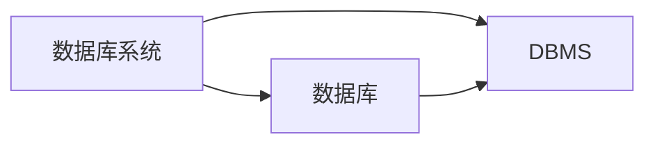

## 概述
### 术语
- DBMS
  
DBMS是数据库管理系统的简称，是一种重要的程序设计系统。它由一个相互关联的数据集合和一组访问这些数据的程序构成。
- 数据库
  
数据库是长期储存在计算机内、有组织、可共享的大量数据的集合。

数据库中的数据按照一定的数据模型组织，描述和存储，可以被各种用户共享，具有较小的冗余度，较高的数据独立性，并且易于拓展。
- 数据库系统

数据库系统由数据库、DBMS、应用程序和数据库管理员组成。

- 数据模型

数据模型是一种形式机制，用于数据建模，描述数据，数据之间的联系，数据的语义，数据上的操作和数据完整性约束的条件。

- 数据库模式

数据库模式是数据库中使用数据模型对数据建模所产生的设计结果。

对于关系数据库而言，数据库模式由一组关系模式构成。
- 数据字典

数据字典是DBMS维护的一系列内部表，用来存放元数据[^1]。

[^1]: 元数据就是关于数据的数据。

### DBMS的主要功能
1. 数据定义
提供数据定义语言DDL，用于定义数据库中的数据对象和它们的结构。
2. 数据操纵
提供数据操纵语言DML，用于操纵数据，实现对数据库的基本操作(CRUD)。
3. 数据事务管理和运行管理
统一管理数据，控制对数据的并发访问，保证数据的一致性、完整性、有效性。确保故障时数据库中的数据不被破坏，并且能恢复到一致的状态。
4. 数据存储和查询处理
确定数据的物理组织和存取方式，提供数据的持久存储和，提供数据的查询处理。
5. 数据库的建立和维护
6. 其他功能

